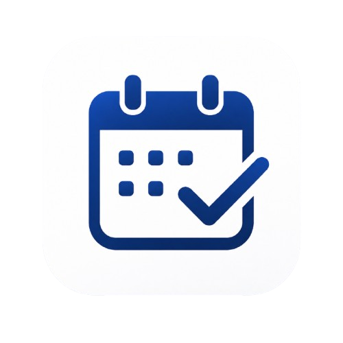

<div align="center">



# Attendly

### Smart Attendance Tracking for Students

A modern, mobile-first attendance management application designed to help students
track attendance, manage timetables, analyze subject-wise performance, and predict
future attendance.

<br />

[](https://attendence-tracker2.web.app)
[](https://github.com/vineel2805/Attendence_tracker)
[](https://react.dev/)
[](https://www.typescriptlang.org/)
[](https://firebase.google.com/)
[](https://capacitorjs.com/)

</div>

---

## Overview

**Attendly** is a student-focused attendance tracking application built around a
simple goal:

> **Know your attendance before it becomes a problem.**

Instead of manually calculating percentages or maintaining attendance records
in spreadsheets, Attendly provides a centralized place to record attendance,
view academic statistics, manage timetables, and understand how future classes
will affect attendance.

The application is designed primarily for mobile use while remaining fully
accessible through the web.

---

## Why Attendly?

Attendance requirements can make a small number of missed classes have a
significant impact on a student's overall percentage.

Attendly helps students:

- Track attendance without manual calculations
- Quickly identify subjects that need attention
- Maintain a structured weekly timetable
- Review attendance history
- Plan future attendance
- Predict how upcoming classes affect their percentage
- Keep their data synchronized across devices

---

## Features

### 📊 Dashboard

A centralized overview of attendance performance.

- Overall attendance percentage
- Total classes
- Present classes
- Absent classes
- Subject-wise attendance
- Attendance status indicators
- Manual attendance baseline support

---

### ✅ Attendance Tracking

Record attendance period by period.

- Mark classes as present or absent
- Support theory and laboratory subjects
- View daily attendance
- Maintain attendance history
- Edit previously recorded attendance
- Holiday support

---

### 📅 Calendar

View attendance history through a monthly calendar.

- Monthly attendance overview
- Color-coded attendance information
- Select individual dates
- Review attendance records
- Edit previous records
- Mark holidays
- Add custom holiday reasons

---

### 📈 Attendance Prediction

Understand how future attendance decisions affect your percentage.

- Select future dates
- Plan attendance for upcoming classes
- Calculate predicted attendance
- Compare current and projected attendance
- Quickly mark future classes as:
  - All Present
  - All Absent
  - Clear

This allows students to make informed decisions before their attendance
drops below the required threshold.

---

### 🗓️ Timetable

Create and manage a weekly class timetable.

- Configure periods for each day
- Assign subjects to periods
- Support different schedules for different weekdays
- Manage theory and laboratory subjects
- Use timetable data for attendance calculations

---

### ⚙️ Settings

Customize attendance and academic configuration.

- Configure period duration
- Configure periods per weekday
- Manage subjects
- Define subject type
- Edit timetable configuration
- Configure attendance baseline

### Attendance Baseline

Students who already have attendance records before using Attendly can enter their existing attendance information.

For example:

```text
Total classes:     120
Classes attended:   95
```

## Documentation

For developers who want to set up, modify, build, or maintain Attendly:

- [Development Guide](docs/DEVELOPMENT.md)
- [Firebase Setup](docs/FIREBASE_SETUP.md)
- [Android Setup](docs/ANDROID_SETUP.md)